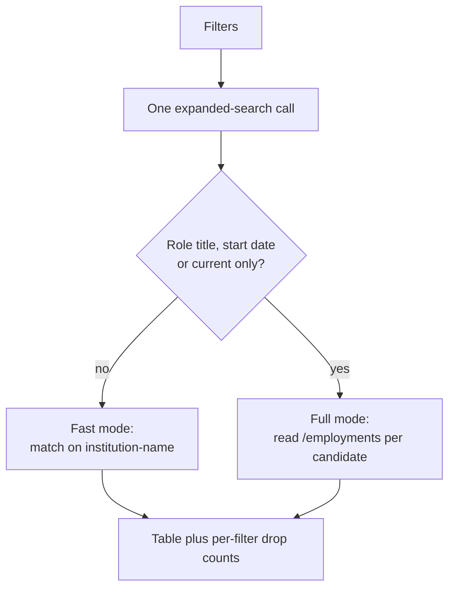

# orcid-finder

**Find the ORCID accounts that declare an institution, filter them the way a research office
would, and take the table away as CSV or JSON.**

Give it a ROR id or an organisation name and it lists the ORCID records that declare that
affiliation. Narrow the list by role title, by whether the appointment has a start date, and by
whether it is still current. Everything runs in the browser against the ORCID public API: no
account, no API key, no backend of ours, nothing stored anywhere.

For research offices, repository managers and anyone assembling a roster: the fastest honest
answer to "who at this institution has an ORCID, and what do their records say?".

🔗 **Live:** not published yet. This repository is private; the page deploys to
`https://rijdho.github.io/orcid-finder/` when it goes public.

Available in **English, German and Spanish** (auto-detected from the browser, switchable).


## What it does

One search produces one table. Each row is an ORCID account, and the columns say what ORCID
itself reports about that person's appointment at the institution you asked about.

| Filter | What it matches | Cost |
| --- | --- | --- |
| ROR id(s) | `ror-org-id` on the account, several at once for a parent ROR with children | free |
| Organisation name(s) | `affiliation-org-name`, as a substring, case-insensitive | free |
| Role title contains | the employment's `role-title`, any of several terms | one request per candidate |
| Must have a start date | drops appointments with no `start-date` at all | one request per candidate |
| Only current appointments | drops appointments whose `end-date` has passed | one request per candidate |
| Max candidates | how many matching accounts to pull and examine, 1 to 1000 | free |

The ROR criteria and the name criteria are OR-ed into one query: an account qualifies by
declaring **any** of them. Ticking a box whose field is empty contributes nothing, and a search
with no usable criterion is refused rather than run against everything.

## The two modes

Which endpoint runs is decided by the filters, not by a switch the user has to understand.



**Fast mode** is a single `expanded-search` call. It returns names and the institution names
ORCID has indexed for each account, so it answers "who declares this affiliation" in seconds
whatever the size of the result.

**Full mode** starts as soon as a filter needs role title, start date or end date. Those three
fields exist only inside a record's `/employments` document, so the tool reads one per
candidate, six at a time, with a progress bar and a Cancel button. Cancelling keeps what was
examined up to that point.

A candidate found by ROR is kept even when the institution name on the record reads
differently, because `expanded-search` returns those names without per-entry ROR ids. Dropping
them would throw away exactly the records the ROR criterion was chosen to find; such rows are
marked **ROR only** in the table.

Every count of what a filter dropped is attributed to the filter that actually dropped it,
using the stage the candidate reached. Without that, a filter doing nothing looks identical to
one doing all the work.


## The output

Both downloads carry every row of the table, not the page on screen.

| Column | Source |
| --- | --- |
| `orcid`, `orcid_url` | the account |
| `name`, `given_name`, `family_name` | the search record, falling back to the credit name |
| `role_title`, `department`, `organization` | the matching employment (full mode only) |
| `start_date`, `end_date` | the matching employment, at the precision ORCID holds |
| `matched_by` | `employment`, `name` or `ror_only` |
| `institutions` | every institution name ORCID indexed, pipe-separated |

The JSON file additionally carries the query sent to ORCID, the mode, the filter set, the
totals and the per-filter drop counts. A file of results without the question that produced
them is not reproducible, and this tool exists to be cited from a methods section.

CSV is written per RFC 4180 with CRLF line endings, and any value that a spreadsheet would
execute as a formula is neutralised with a leading apostrophe. ORCID records are written by the
people they describe, which makes every text field untrusted input.

The search also lives in the URL, so a result can be linked, bookmarked or pasted into a
protocol, and it re-runs on load.

## Tests

Node's built-in runner, no dependencies:

```bash
node --test tests/*.test.mjs
```

Three layers: the filter logic with exact expected values and every HTTP call injected; the
export layer, aimed at the failures that still produce a file (a sheared row, a formula that
executes on open, a column that quietly went missing); and i18n key and placeholder parity
across the three locales, including a check that every `data-i18n` key the page asks for
exists.

The suite was validated by injecting five deliberate defects, one per layer, and confirming
each one turned the suite red before reverting it.

## Run locally

No build step. Any static server will do, and it has to be a server rather than `file://`
because the app is ES modules:

```bash
python3 -m http.server 8777
open http://localhost:8777/
```

Regenerating the screenshots needs Puppeteer, which is a tooling-only dependency and never
ships:

```bash
npm i puppeteer
node docs/screenshots.mjs docs "http://localhost:8777/?ror=03yrm5c26&byName=0&max=16&current=1&started=1&lang=en"
```

## Deploy

GitHub Pages via the Actions workflow in `.github/workflows/deploy.yml`, which gates the deploy
on the test suite and uploads the tree verbatim. The legacy Jekyll builder is bypassed on
purpose.

## Caveats

- **ORCID is self-asserted.** A record says what its owner typed. An institution's real roster
  is larger than what ORCID shows and may differ in role titles, spelling and dates.
- **Absence is not evidence.** Staff who never added the affiliation, or who have no ORCID at
  all, cannot appear here. This is a discovery tool, not a headcount, and the number it returns
  does not support a statement about how many people work somewhere.
- **Names match as substrings.** "Vienna" matches every institution whose name contains it. The
  ROR id is the precise criterion; the name is the fallback for records that carry no ROR.
- **Only the first qualifying employment is reported.** Someone with several appointments at
  the same institution appears once, under the one that passed the filters.
- **A partial end date is read at its latest instant.** "Ended 2026" counts as current for all
  of 2026, so that current staff are not silently dropped. The opposite error would delete
  people from a roster without saying so.
- **The public API rate-limits.** A large full-mode run can be throttled. The tool backs off
  and retries, and reports separately any record it still could not read, so a network failure
  is never counted as a filter verdict.
- **Max candidates is a cap on what is examined, not on what exists.** The result always states
  how many accounts ORCID says match, next to how many were actually pulled.

## License

MIT. See `LICENSE`.
