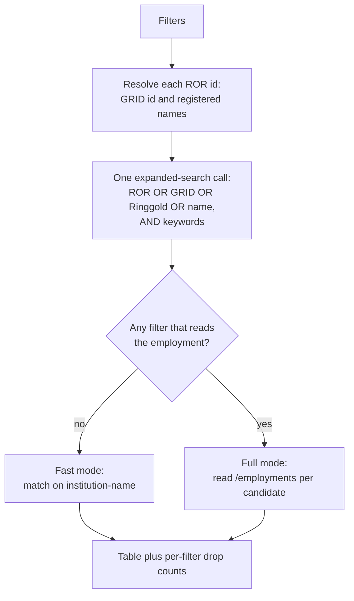

# orcid-finder

[](https://doi.org/10.5281/zenodo.22227424)

**Find the ORCID accounts that declare an institution, narrow them by keyword, role,
department, country, dates and who asserted the record, and export the table as CSV or JSON.**

Give it a ROR id or an organisation name and it lists the ORCID records that declare that
affiliation. Everything runs in the browser against the public ORCID and ROR APIs, the only two
hosts the page contacts: no account, no API key, and no server of ours in the path. The only
thing it keeps is the language and theme you picked, in the browser's own storage.

For research offices, repository managers and anyone assembling a roster from public records:
it answers "who at this institution has an ORCID, and what do their records say?", and the
Caveats say where that answer stops.

🔗 **Live:** <https://rijdho.github.io/orcid-finder/>

Available in **English, German and Spanish** (auto-detected from the browser, switchable).


## What it does

One search produces one table. Each row is an ORCID account, and the columns say what ORCID
itself reports about that person's appointment at the institution you asked about.

| Filter | What it matches | Cost |
| --- | --- | --- |
| ROR id(s) | `ror-org-id`, plus the `grid-org-id` resolved from it | one request per ROR id |
| Ringgold id(s) | `ringgold-org-id`, which an institutional system may stamp instead of ROR | free |
| Organisation name(s) | the affiliation name field, as a substring, case-insensitive | free |
| Affiliation: any, current, past | switches to `current-` or `past-institution-affiliation-name` | free |
| Keyword(s) | `keyword` on the record, AND-ed onto the institution | free |
| Role title contains | the employment's `role-title`, any of several terms | one request per candidate |
| Role title must not contain | the same field, as an exclusion | one request per candidate |
| Department contains | the employment's `department-name` | one request per candidate |
| Country code(s) | the employment organisation's address country | one request per candidate |
| Started from / to | the year of the employment's `start-date` | one request per candidate |
| Must have a start date | drops appointments with no `start-date` at all | one request per candidate |
| Only current appointments | drops appointments whose `end-date` has passed | one request per candidate |
| Only organisation-asserted | keeps only employments a member organisation wrote, not the researcher | one request per candidate |
| Max candidates | how many matching accounts to pull and examine, 1 to 2000 | free |

The institution criteria are OR-ed into one query: an account qualifies by declaring **any** of
the identifiers or **any** of the names. Keywords, when given, are AND-ed onto that block, so
they narrow the institution rather than widening the search. Ticking a box whose field is empty
contributes nothing, and a search with no usable criterion is refused rather than run against
everything.

Two limits of the ORCID query language shape the rest. There is no negation, so role exclusion
happens on the record already in hand rather than in the query. And `role-title` is not a
searchable field at all, which is why any filter on a role costs a request per candidate and
can never be free.

## The two modes

Which endpoint runs is decided by the filters, not by a mode switch in the interface.



**Fast mode** is a single `expanded-search` call. It returns names and the institution names
ORCID has indexed for each account, so it answers "who declares this affiliation" in seconds
whatever the size of the result.

**Full mode** starts as soon as a filter needs role title, start date or end date. Those three
fields exist only inside a record's `/employments` document, so the tool reads one per
candidate, six at a time, with a progress bar and a Cancel button. Cancelling keeps what was
examined up to that point.

A candidate found by ROR is kept even when the institution name on the record reads
differently, because `expanded-search` returns those names without per-entry ROR ids. Dropping
them would throw away exactly the records the ROR criterion was chosen to find; such rows are
marked **ROR only** in the table.

Every count of what a filter dropped is attributed to the filter that actually dropped it,
using the stage the candidate reached. Without that, a filter doing nothing looks identical to
one doing all the work.


## Who asserted the record

ORCID records the writer of every item in a `source` field, and that field is the difference
between a claim and a claim a second party stands behind. An employment the researcher typed in
carries their own iD as its source. One written by a member organisation's system, typically
the university itself, carries that member's client id instead, and the table names it.

Both are shown, in a column of their own, and either can be filtered on. Neither is presented
as better data: a self-asserted appointment is frequently the more current of the two, because
it does not wait on an institutional export. What the column adds is the ability to say which
of the two you are looking at, which a roster reconciliation cannot do without.

The column carries four values: `organization`, `self`, `other` (another iD, which ORCID allows
through a trusted-individual delegation) and `unknown` (the employment carries no source at
all). In fast mode it is empty, because no employment was opened; empty means unknown, never
`self`.

### Why the ROR id alone is not enough

An institution has more than one identifier, and ORCID indexes each of them separately.
Counting the accounts ORCID reports as declaring Karolinska Institutet:

| Query | Accounts ORCID reports |
| --- | --- |
| `ror-org-id` alone | 4,206 |
| `ror-org-id OR grid-org-id` | 5,318 |
| `ror-org-id OR grid-org-id OR ringgold-org-id` | 9,547 |

The ROR id alone sees under half. So each ROR id is resolved against the ROR registry before
the query is built, and the **GRID id** it holds is OR-ed in automatically: ROR was seeded from
GRID, the mapping is one to one, and it costs nothing the user has to think about.

The **Ringgold id** stays a field you fill in deliberately. ROR does not carry Ringgold ids,
and a Ringgold id is coarser than a ROR one: `27106` covers both Karolinska Institutet and
Karolinska University Hospital. It is the largest single gain available and the one most likely
to widen a result past the institution you meant, which is exactly the combination that should
be a deliberate act rather than a silent default.

The same registry lookup fixes a second problem, on the matching side. ORCID lets an employment
be disambiguated with any scheme, and the ones an institution's own system writes are
not always ROR: they may be RINGGOLD or FUNDREF. Karolinska stamps `27106 / RINGGOLD` on the
employments it asserts. Matching employments on the ROR id alone therefore dropped precisely
the organisation-asserted records, and searching Karolinska by ROR with the asserted-only
filter returned nothing at all. The names ROR registers for the id are matched on as well, and
the result says which ones it used.

Registered acronyms are deliberately excluded and anything shorter than four characters is
dropped: Karolinska's registered acronym is `KI`, and `KI` as a substring matches a large part
of ORCID. A needle that matches everything turns the filter off while the result still looks
filtered.


### Current, past and keywords

`current-institution-affiliation-name` and `past-institution-affiliation-name` are separate
ORCID fields, and `current OR past` returns exactly what the plain name field returns, so the
three are a clean partition. **Past** is how you find former staff and alumni, which nothing
else here reaches.

ORCID indexes those two only on the name, never on an identifier. Choosing current or past
therefore searches by organisation name alone and the identifier fields sit out. Leaving them
in would return current staff in a search for former ones, so the tool refuses rather than
pretending, and says why.

**Keywords** are the terms researchers put on their own ORCID record. They are AND-ed onto the
institution block, so they answer "who here works on this" inside one query, at no extra cost.

## The output

Both downloads carry every row of the table, not the page on screen.

| Column | Source |
| --- | --- |
| `orcid`, `orcid_url` | the account |
| `name`, `given_name`, `family_name` | the search record, falling back to the credit name |
| `role_title`, `department`, `organization` | the matching employment (full mode only) |
| `country`, `city` | the employment organisation's address, as ORCID holds it |
| `start_date`, `end_date` | the matching employment, at the precision ORCID holds |
| `matched_by` | `employment`, `name` or `ror_only` |
| `asserted_by` | `organization`, `self`, `other` or `unknown`; empty in fast mode |
| `assertion_source` | the name ORCID gives for the writer of the employment |
| `assertion_origin` | the party the source names as the origin of the assertion, when it names one |
| `institutions` | every institution name ORCID indexed, pipe-separated |

The JSON file additionally carries the query sent to ORCID, the mode, the filter set, the names
and GRID ids resolved from ROR, the totals and the per-filter drop counts. A file of results
without the query that produced it cannot be checked or repeated, which is what that block is
for.

CSV is written per RFC 4180 with CRLF line endings, and any value that a spreadsheet would
execute as a formula is neutralised with a leading apostrophe. ORCID records are written by the
people they describe, which makes every text field untrusted input.

The search also lives in the URL, so a result can be linked, bookmarked or pasted into a
protocol, and it re-runs on load.

## Tests

Node's built-in runner, no dependencies:

```bash
node --test tests/*.test.mjs
```

Three layers: the filter logic with exact expected values and every HTTP call injected; the
export layer, aimed at the failures that still produce a file (a sheared row, a formula that
executes on open, a column that quietly went missing); and i18n key and placeholder parity
across the three locales, including a check that every `data-i18n` key the page asks for
exists.

The suite was validated by injecting five deliberate defects, one per layer, and confirming
each one turned the suite red before reverting it.

## Run locally

No build step. Any static server will do, and it has to be a server rather than `file://`
because the app is ES modules:

```bash
python3 -m http.server 8777
open http://localhost:8777/
```

Regenerating the screenshots needs Puppeteer, which is a tooling-only dependency and never
ships:

```bash
npm i puppeteer
node docs/screenshots.mjs docs "http://localhost:8777/?ror=056d84691&byName=0&max=12&asserted=1&country=SE&lang=en"
```

## Deploy

GitHub Pages via the Actions workflow in `.github/workflows/deploy.yml`, which gates the deploy
on the test suite and uploads the tree verbatim. The legacy Jekyll builder is bypassed on
purpose.

## Security and privacy

There is nothing here to steal and nothing here to trust. The tool is a static page: no
backend, no accounts, no cookies, no analytics, and no API key, because the ORCID public API
does not need one. The only thing it stores is the language and theme you picked, in your own
browser. Both the working tree and the full commit history were swept for credentials before
the repository was opened.

Everything ORCID and ROR return is escaped before it reaches the page, and a
Content-Security-Policy of `default-src 'none'` stands behind that: scripts, styles and fonts
may come only from this origin, and the browser refuses to connect anywhere except
`pub.orcid.org` and `api.ror.org`. That turns the page's central claim into something enforced
rather than promised, and it means a missed escape in some future edit cannot load a script or
send anything anywhere. `tests/csp.test.mjs` pins the policy to the hosts the code actually
calls, so adding an API and forgetting the policy fails the suite instead of the deployed page.

Two things it does not cover, stated rather than glossed. Clickjacking protection needs
`frame-ancestors` or `X-Frame-Options`, which are response headers GitHub Pages cannot set. And
the code is served to the browser in full, as all client-side code is: it can be read, copied
and rehosted, which is what the licence is for and not something a technical measure can
change.

ORCID's search returns an email address for records whose owner made it public. This tool never
displays or exports it. A downloaded list of people is personal data, and what it is used for
is the downloader's responsibility under their own rules; making a mailing list the easy path
is not this tool's job.

## Caveats

- **Most of ORCID is self-asserted.** A record usually says what its owner typed. An
  institution's real roster is larger than what ORCID shows and may differ in role titles,
  spelling and dates.
- **An organisation-asserted employment is evidence, not proof of the present.** It says a
  member's system wrote the entry at some point. It does not say the appointment still runs,
  and it does not mean the asserting organisation is the employer: funders and national
  aggregators assert too, which is why the table names the source rather than only flagging it.
- **Fast mode reports no source at all.** Who asserted an employment lives in the employment
  record, so the column is empty until a filter opens it. Empty means unknown, never
  self-asserted.
- **The email field is never shown or exported.** See Security and privacy above.
- **A Ringgold id is coarser than a ROR id.** `27106` returns both Karolinska Institutet and
  Karolinska University Hospital. It is the largest coverage gain on offer and the likeliest to
  reach past the institution you meant, so read the organisation column before trusting a
  count.
- **Keywords are sparse.** Most ORCID records carry none, so a keyword filter returns the
  subset who happen to have filled that field in, never everyone at the institution who works
  on the topic. It is a way in, not a census of a research area.
- **Current and past are the account holder's account of themselves.** ORCID derives them from
  the end dates on the record, so someone who left and never updated it still counts as
  current.
- **Resolving a ROR id to its names widens the affiliation match.** It is what keeps the
  organisation-asserted records, but a registered name that is also a common word will match
  more than the institution. The names actually used are printed with the result so the
  widening is visible rather than assumed.
- **Absence is not evidence.** Staff who never added the affiliation, or who have no ORCID at
  all, cannot appear here. This is a discovery tool, not a headcount, and the number it returns
  does not support a statement about how many people work somewhere.
- **Names match as substrings.** "Vienna" matches every institution whose name contains it. The
  ROR id is the precise criterion; the name is the fallback for records that carry no ROR.
- **Only the first qualifying employment is reported.** Someone with several appointments at
  the same institution appears once, under the one that passed the filters.
- **A partial end date is read at its latest instant.** "Ended 2026" counts as current for all
  of 2026, so that current staff are not silently dropped. The opposite error would delete
  people from a roster without saying so.
- **The public API rate-limits.** A large full-mode run can be throttled. The tool backs off
  and retries, and reports separately any record it still could not read, so a network failure
  is never counted as a filter verdict.
- **Max candidates is a cap on what is examined, not on what exists.** The result always states
  how many accounts ORCID says match, next to how many were actually pulled.

## License

Copyright (C) 2026 Ricardo Hartley Belmar.

[AGPL-3.0-or-later](LICENSE): read, cite, fork and adapt freely; if you run a modified version
as a network service, publish your changes under the same licence. This is a browser tool, so
that clause is the one that bites: a rehosted derivative owes its source back. Nothing here was
ever published under another licence.

## Citation

If you use this tool in a piece of work, please cite it: see `CITATION.cff`, or the "Cite this
repository" button in the sidebar of the GitHub page.

Archived on Zenodo: concept DOI <https://doi.org/10.5281/zenodo.22227424>, which always resolves
to the latest version. Cite that one unless you need to pin a specific snapshot; each release
also has its own version DOI, recorded in the CHANGELOG.
