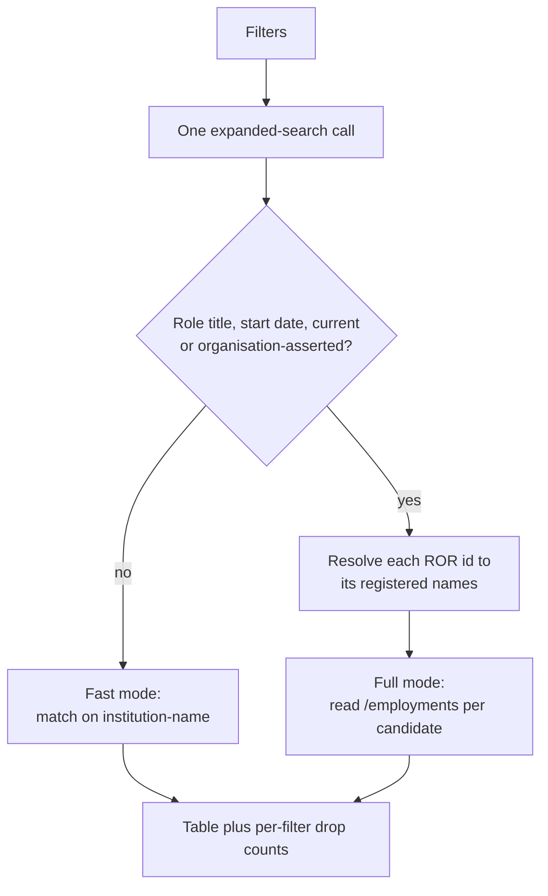

# orcid-finder

**Find the ORCID accounts that declare an institution, narrow them by role title, start date,
current appointments and who asserted the record, and export the table as CSV or JSON.**

Give it a ROR id or an organisation name and it lists the ORCID records that declare that
affiliation. Everything runs in the browser against the public ORCID and ROR APIs, the only two
hosts the page contacts: no account, no API key, and no server of ours in the path. The only
thing it keeps is the language and theme you picked, in the browser's own storage.

For research offices, repository managers and anyone assembling a roster from public records:
it answers "who at this institution has an ORCID, and what do their records say?", and the
Caveats say where that answer stops.

🔗 **Live:** <https://rijdho.github.io/orcid-finder/>

Available in **English, German and Spanish** (auto-detected from the browser, switchable).


## What it does

One search produces one table. Each row is an ORCID account, and the columns say what ORCID
itself reports about that person's appointment at the institution you asked about.

| Filter | What it matches | Cost |
| --- | --- | --- |
| ROR id(s) | `ror-org-id` on the account, several at once for a parent ROR with children | free |
| Organisation name(s) | `affiliation-org-name`, as a substring, case-insensitive | free |
| Role title contains | the employment's `role-title`, any of several terms | one request per candidate |
| Must have a start date | drops appointments with no `start-date` at all | one request per candidate |
| Only current appointments | drops appointments whose `end-date` has passed | one request per candidate |
| Only organisation-asserted | keeps only employments a member organisation wrote, not the researcher | one request per candidate |
| Max candidates | how many matching accounts to pull and examine, 1 to 1000 | free |

The ROR criteria and the name criteria are OR-ed into one query: an account qualifies by
declaring **any** of them. Ticking a box whose field is empty contributes nothing, and a search
with no usable criterion is refused rather than run against everything.

## The two modes

Which endpoint runs is decided by the filters, not by a mode switch in the interface.



**Fast mode** is a single `expanded-search` call. It returns names and the institution names
ORCID has indexed for each account, so it answers "who declares this affiliation" in seconds
whatever the size of the result.

**Full mode** starts as soon as a filter needs role title, start date or end date. Those three
fields exist only inside a record's `/employments` document, so the tool reads one per
candidate, six at a time, with a progress bar and a Cancel button. Cancelling keeps what was
examined up to that point.

A candidate found by ROR is kept even when the institution name on the record reads
differently, because `expanded-search` returns those names without per-entry ROR ids. Dropping
them would throw away exactly the records the ROR criterion was chosen to find; such rows are
marked **ROR only** in the table.

Every count of what a filter dropped is attributed to the filter that actually dropped it,
using the stage the candidate reached. Without that, a filter doing nothing looks identical to
one doing all the work.


## Who asserted the record

ORCID records the writer of every item in a `source` field, and that field is the difference
between a claim and a claim a second party stands behind. An employment the researcher typed in
carries their own iD as its source. One written by a member organisation's system, typically
the university itself, carries that member's client id instead, and the table names it.

Both are shown, in a column of their own, and either can be filtered on. Neither is presented
as better data: a self-asserted appointment is frequently the more current of the two, because
it does not wait on an institutional export. What the column adds is the ability to say which
of the two you are looking at, which a roster reconciliation cannot do without.

The column carries four values: `organization`, `self`, `other` (another iD, which ORCID allows
through a trusted-individual delegation) and `unknown` (the employment carries no source at
all). In fast mode it is empty, because no employment was opened; empty means unknown, never
`self`.

### Why the ROR id alone is not enough

ORCID lets an employment be disambiguated with any scheme, and the ones an institution's own
system writes are frequently RINGGOLD or FUNDREF rather than ROR. Karolinska Institutet's ORCID
integration, for one, stamps `27106 / RINGGOLD` on the employments it asserts.

Matching employments on the ROR id alone therefore drops precisely the organisation-asserted
records, which are the most corroborated ones in the result: searching Karolinska by ROR with
the asserted-only filter returned nothing at all. So before the employment checks run, the tool
resolves each ROR id to the names the registry holds for it and matches on those as well. One
request per ROR id, run alongside the search. The result says which names it used.

Registered acronyms are deliberately excluded and anything shorter than four characters is
dropped: Karolinska's registered acronym is `KI`, and `KI` as a substring matches a large part
of ORCID. A needle that matches everything turns the filter off while the result still looks
filtered.

## The output

Both downloads carry every row of the table, not the page on screen.

| Column | Source |
| --- | --- |
| `orcid`, `orcid_url` | the account |
| `name`, `given_name`, `family_name` | the search record, falling back to the credit name |
| `role_title`, `department`, `organization` | the matching employment (full mode only) |
| `start_date`, `end_date` | the matching employment, at the precision ORCID holds |
| `matched_by` | `employment`, `name` or `ror_only` |
| `asserted_by` | `organization`, `self`, `other` or `unknown`; empty in fast mode |
| `assertion_source` | the name ORCID gives for the writer of the employment |
| `assertion_origin` | the party the source names as the origin of the assertion, when it names one |
| `institutions` | every institution name ORCID indexed, pipe-separated |

The JSON file additionally carries the query sent to ORCID, the mode, the filter set, the names
resolved from ROR, the totals and the per-filter drop counts. A file of results without the
query that produced it cannot be checked or repeated, which is what that block is for.

CSV is written per RFC 4180 with CRLF line endings, and any value that a spreadsheet would
execute as a formula is neutralised with a leading apostrophe. ORCID records are written by the
people they describe, which makes every text field untrusted input.

The search also lives in the URL, so a result can be linked, bookmarked or pasted into a
protocol, and it re-runs on load.

## Tests

Node's built-in runner, no dependencies:

```bash
node --test tests/*.test.mjs
```

Three layers: the filter logic with exact expected values and every HTTP call injected; the
export layer, aimed at the failures that still produce a file (a sheared row, a formula that
executes on open, a column that quietly went missing); and i18n key and placeholder parity
across the three locales, including a check that every `data-i18n` key the page asks for
exists.

The suite was validated by injecting five deliberate defects, one per layer, and confirming
each one turned the suite red before reverting it.

## Run locally

No build step. Any static server will do, and it has to be a server rather than `file://`
because the app is ES modules:

```bash
python3 -m http.server 8777
open http://localhost:8777/
```

Regenerating the screenshots needs Puppeteer, which is a tooling-only dependency and never
ships:

```bash
npm i puppeteer
node docs/screenshots.mjs docs "http://localhost:8777/?ror=056d84691&byName=0&max=40&asserted=1&lang=en"
```

## Deploy

GitHub Pages via the Actions workflow in `.github/workflows/deploy.yml`, which gates the deploy
on the test suite and uploads the tree verbatim. The legacy Jekyll builder is bypassed on
purpose.

## Caveats

- **Most of ORCID is self-asserted.** A record usually says what its owner typed. An
  institution's real roster is larger than what ORCID shows and may differ in role titles,
  spelling and dates.
- **An organisation-asserted employment is evidence, not proof of the present.** It says a
  member's system wrote the entry at some point. It does not say the appointment still runs,
  and it does not mean the asserting organisation is the employer: funders and national
  aggregators assert too, which is why the table names the source rather than only flagging it.
- **Fast mode reports no source at all.** Who asserted an employment lives in the employment
  record, so the column is empty until a filter opens it. Empty means unknown, never
  self-asserted.
- **Resolving a ROR id to its names widens the affiliation match.** It is what keeps the
  organisation-asserted records, but a registered name that is also a common word will match
  more than the institution. The names actually used are printed with the result so the
  widening is visible rather than assumed.
- **Absence is not evidence.** Staff who never added the affiliation, or who have no ORCID at
  all, cannot appear here. This is a discovery tool, not a headcount, and the number it returns
  does not support a statement about how many people work somewhere.
- **Names match as substrings.** "Vienna" matches every institution whose name contains it. The
  ROR id is the precise criterion; the name is the fallback for records that carry no ROR.
- **Only the first qualifying employment is reported.** Someone with several appointments at
  the same institution appears once, under the one that passed the filters.
- **A partial end date is read at its latest instant.** "Ended 2026" counts as current for all
  of 2026, so that current staff are not silently dropped. The opposite error would delete
  people from a roster without saying so.
- **The public API rate-limits.** A large full-mode run can be throttled. The tool backs off
  and retries, and reports separately any record it still could not read, so a network failure
  is never counted as a filter verdict.
- **Max candidates is a cap on what is examined, not on what exists.** The result always states
  how many accounts ORCID says match, next to how many were actually pulled.

## License

MIT. It is a tool: the payload is code meant to be reused. See `LICENSE`.

## Citation

If you use this tool in a piece of work, please cite it: see `CITATION.cff`, or the "Cite this
repository" button in the sidebar of the GitHub page.
